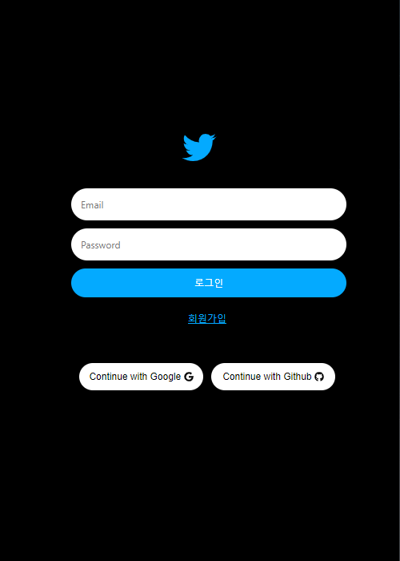
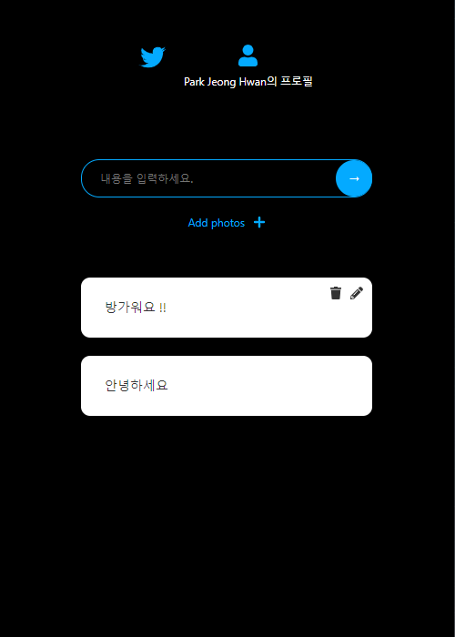
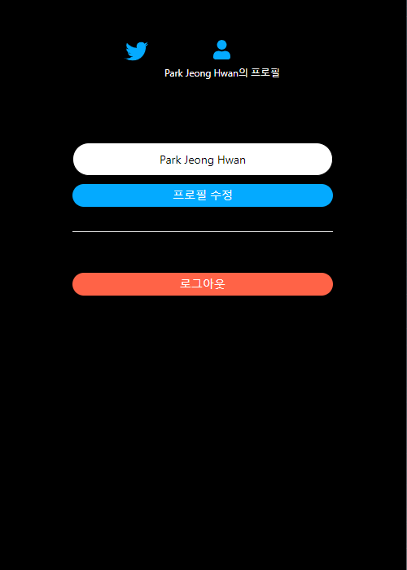

<div align="center">
  <br />
  
  <br />
  <h1>트위터 클론 (Twitter Clone)</h1>
  <a href="https://jeonghwan-dev.github.io/twitter-clone-coding/#/">
    
  </a>
  <br />
</div>

## 목차

1. [**웹 서비스 소개**](#1)
2. [**기술 스택**](#2)
3. [**주요 기능**](#3)
4. [**주요 페이지**](#4)
5. [**실행 방법**](#5)

<br />

<div id="1"></div>

## 💁🏻‍♂ 웹 서비스 소개

**React**와 **Firebase**를 사용하여 직접 `트위터의 주요 기능들을 클론` 한 웹 서비스입니다.

<br />

[**🔗 배포된 웹 서비스로 바로가기 Click !**](https://jeonghwan-dev.github.io/twitter-clone-coding/#/) 👈

> 새 창 열기 방법 : CTRL+click (on Windows and Linux) | CMD+click (on MacOS)

<br />

<div id="2"></div>

## 🛠 기술 스택

**Front-end**

-   
- 

**Back-end**

- 

**DevOps**

-  

<br />

<div id="3"></div>

## 💡 주요 기능

- Email, Google 계정, Github 계정을 이용한 회원가입 및 로그인 기능
- Tweet 게시글 CRUD(Create, Read, Update, Delete)
- 프로필 페이지 구현
- 사진 파일 업로드 기능

<br />

<div id="4"></div>

## 📄 주요 페이지

|                               로그인 페이지                               |                              메인 페이지                              |                               프로필 페이지                                |
| :-----------------------------------------------------------------------: | :-------------------------------------------------------------------: | :------------------------------------------------------------------------: |
|  |  |  |

<br />

<div id="5"></div>

## 💻 실행 방법

1. **원격 저장소 복제**

```bash
$ git clone https://github.com/JeongHwan-dev/twitter-clone-coding.git
```

2. **프로젝트 폴더로 이동**

```bash
$ cd twitter-clone-coding
```

3. **필요한 node_modules 설치**

```bash
$ npm install
```

4. **리액트 앱 실행**

```bash
$ npm start
```
